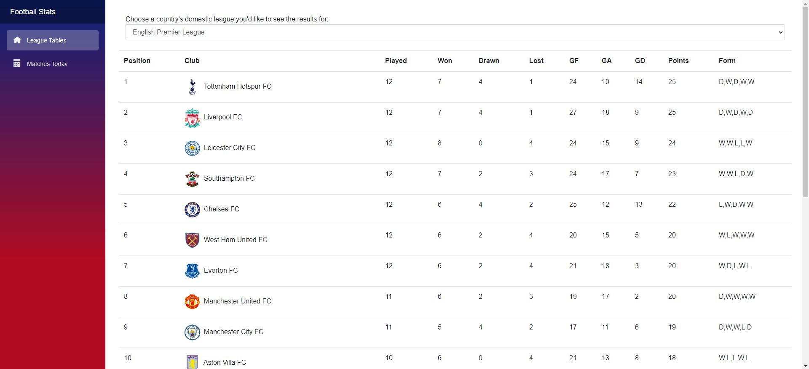
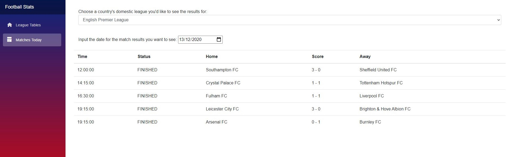

# Enterprise Application Development: Continous Assessment 3

Check it out at: https://brave-flower-07f387c03.azurestaticapps.net

### What is it?
This CA was a single page application using .NET 5 Blazor WebAssembly, and Bunit and Xunit for unit tests.
It queries a <a href ="https://www.football-data.org/documentation/api"> football-data.org </a>'s API for domestic football (soccer) league information, like the current standings and matches on the current day.
There are filters for the different European leagues and the date, so a user can view the matches that might've happened on a certain day.
It is deployed on Azure App Engine using the link above. 

### Screenshots

  

